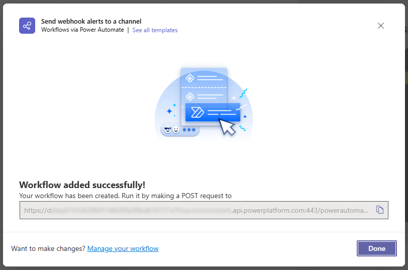

# MS Teams Workflow Webhook for Node

[](https://app.deepsource.com/gh/cityssm/node-ms-teams-workflow-webhook/)
[](https://codecov.io/gh/cityssm/node-ms-teams-workflow-webhook)

Sends a formatted message (i.e. [Adaptive Card](https://adaptivecards.io/))
to a Microsoft Teams workflow webhook.

## Installation

```sh
npm install @cityssm/ms-teams-workflow-webhook
```

## Usage



To send a message to a channel in Teams, you need to create a webhook URL.

[**The basics of creating a webhook URL are described**](./docs/README.md).
More advanced scenarios can be set up with the help of your Teams administrator.

Note that not all
[Adaptive Card elements](https://adaptivecards.io/explorer/AdaptiveCard.html)
have Typescript types recognized in this package (yet)
as they are added on an as-need basis, however, they may still work.

```javascript
import sendMessageToTeamsWebhook from '@cityssm/ms-teams-workflow-webhook'

const webhookUrl = 'https://x.api.powerplatform.com/powerautomate/...'

await sendMessageToTeamsWebhook(webhookUrl, {
  cardElements: [
    {
      type: 'TextBlock',
      text: 'Test message'
    }
  ],
  actions: {
    openUrl: {
      title: 'Visit on GitHub',
      url: 'https://github.com/cityssm/node-ms-teams-workflow-webhook'
    }
  }
})
```

## Related Packages

[**ms-teams-webhook**](https://www.npmjs.com/package/ms-teams-webhook)<br />
v2.2.2 uses message cards and webhooks no longer available in Teams.
Note that if the **ms-teams-webhook** project is updated to support Adaptive Cards
and the new webhook URLs, it is a far more mature package than this one!
