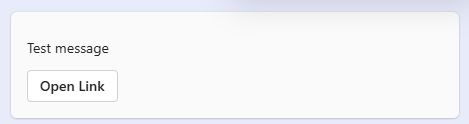
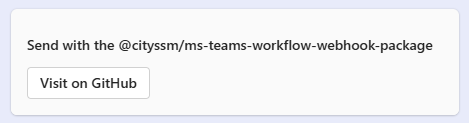
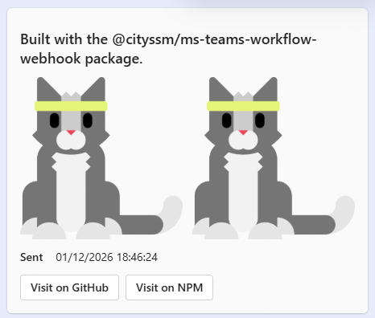

# MS Teams Workflow Webhook for Node

[](https://app.deepsource.com/gh/cityssm/node-ms-teams-workflow-webhook/)
[](https://codecov.io/gh/cityssm/node-ms-teams-workflow-webhook)
[](https://sonarcloud.io/summary/new_code?id=cityssm_node-ms-teams-workflow-webhook)

Sends a formatted message (i.e. [Adaptive Card](https://adaptivecards.io/))
to a [Microsoft Teams](https://www.microsoft.com/en-ca/microsoft-teams/) workflow webhook.

**Always be mindful of the data you send by webhook.**
Consider keeping the sensitive details behind a link you authenticate!

## Installation

```sh
npm install @cityssm/ms-teams-workflow-webhook
```

## Usage


To send a message to a channel in Teams, you need to create a webhook URL.

[**The basics of creating a webhook URL are described.**](./docs/README.md)
This package is built to work with
Microsoft's "Send webhook alerts to a channel" workflow template.

Note that not all
[Adaptive Card elements](https://adaptivecards.io/explorer/AdaptiveCard.html)
have Typescript types recognized in this package (yet).
Elements and actions are added on an as-need basis, however, they may still work.

```javascript
import sendMessageToTeamsWebhook from '@cityssm/ms-teams-workflow-webhook'
import { recordToFactSet } from '@cityssm/ms-teams-workflow-webhook/helpers'

const webhookURL = 'https://x.api.powerplatform.com/powerautomate/...'
```

## Simple Message

To display simple text content, pass a string as a Card Element.
To display a simple link in the footer, pass the URL as the action.

```javascript
await sendMessageToTeamsWebhook(
  webhookURL,
  'Test message',
  'https://github.com/cityssm/node-ms-teams-workflow-webhook'
)
```



## Single Element, Single Action

Need to be a bit more complex?
Pass a single Card Element object, and optionally a single Action object.

```javascript
await sendMessageToTeamsWebhook(
  webhookURL,
  {
    type: 'TextBlock',
    text: 'Send with the @cityssm/ms-teams-workflow-webhook-package',
    weight: 'bolder'
  },
  {
    type: 'Action.OpenUrl',
    title: 'Visit on GitHub',
    url: 'https://github.com/cityssm/node-ms-teams-workflow-webhook'
  }
)
```



## Complex Example

The elements and actions can also be arrays!

```javascript

await sendMessageToTeamsWebhook(
  webhookURL,
  [
    {
      type: 'TextBlock',
      text: 'Built with the @cityssm/ms-teams-workflow-webhook package.',
      weight: 'bolder',
      size: 'large',
      wrap: true
    },
    {
      type: 'ColumnSet',
      columns: [
        {
          type: 'Column',
          items: [
            {
              type: 'Image',
              url: 'https://adaptivecards.io/content/cats/1.png'
            }
          ]
        },
        {
          type: 'Column',
          items: [
            {
              type: 'Image',
              url: 'https://adaptivecards.io/content/cats/1.png'
            }
          ]
        }
      ]
    },
    recordToFactSet({
      Sent: new Date().toISOString()
    })
  ],
  [
    {
      type: 'Action.OpenUrl',
      title: 'Visit on GitHub',
      url: 'https://github.com/cityssm/node-ms-teams-workflow-webhook'
    },
    {
      type: 'Action.OpenUrl',
      title: 'Visit on NPM',
      url: 'https://www.npmjs.com/package/@cityssm/ms-teams-workflow-webhook'
    }
  ]
)
```



## Related Package - ms-teams-webhook

[ms-teams-webhook](https://www.npmjs.com/package/ms-teams-webhook) v2.2.2
uses message cards and webhooks no longer available in Teams.
Note that if the **ms-teams-webhook** project is updated to support Adaptive Cards
and the new webhook URLs, it is a far more mature package than this one!
