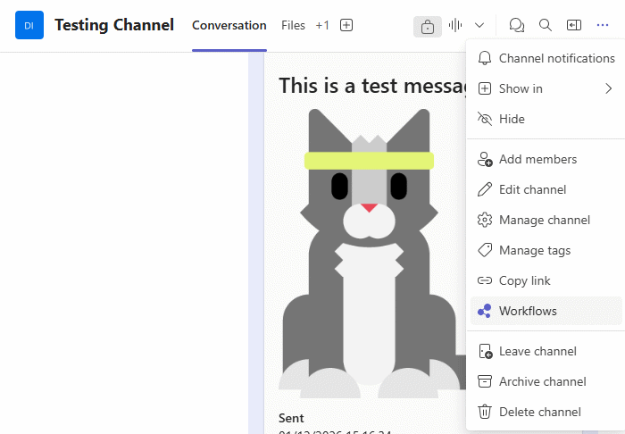
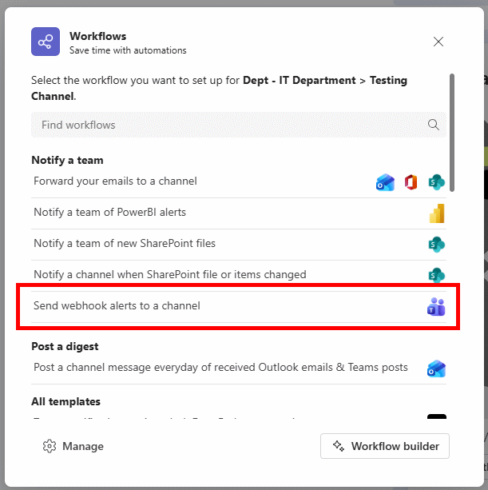
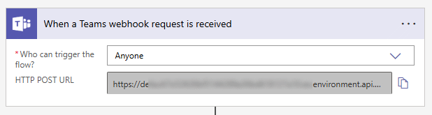
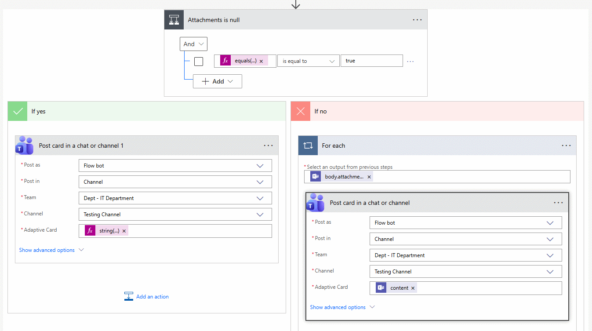

# Setting Up a Webhook in Microsoft Teams

**This is not meant to be a complete guide to creating and managing Teams workflows.**

To send a message to a channel in Teams, you need to generate a webhook URL.
Your ability to do so may be limited by your Office 365 licence,
and by your permissions in the corresponding team and channel.

View the channel you wish to send messages to.
Open the Options menu, and select "Workflows".

Select the "Send webhook alerts to a channel" workflow template.

Follow through the basic setup.

When the webhook is created, the required webhook URL is shown.

**The webhook may not be ready at this point though, depending on permissions in the team.**

The trigger permission for the workflow may be restricted.
At this time, this package requires the trigger permissions to be unrestricted.

Also by default, the webhook will attempt to post messages as "Flow bot".
If the bot does not have permissions to post within the team,
messages sent to the webhook will not post.

To update the webhook, click "Manage your workflow".

**Note that the template for generating the workflow is subject to change.**

This may mean that the locations described below may have different names,
or may be in slightly different places.

At the top of the workflow, the webhook is defined.
Make sure that the "Who can trigger the flow" value is set to "Anyone".
You can also retrieve the webhook URL here if necessary.

At this time, the posting user is located in two places within the workflow.
When editing, expand the "Attachments is null" section, and look for the
"Post card in a chat or channel" blocks.

To post as yourself, the creator of the workflow, change the "Post as" value
to "User". Be sure to save any changes!
